# 🚀 Flutter E-Commerce Application

<p align="center">
  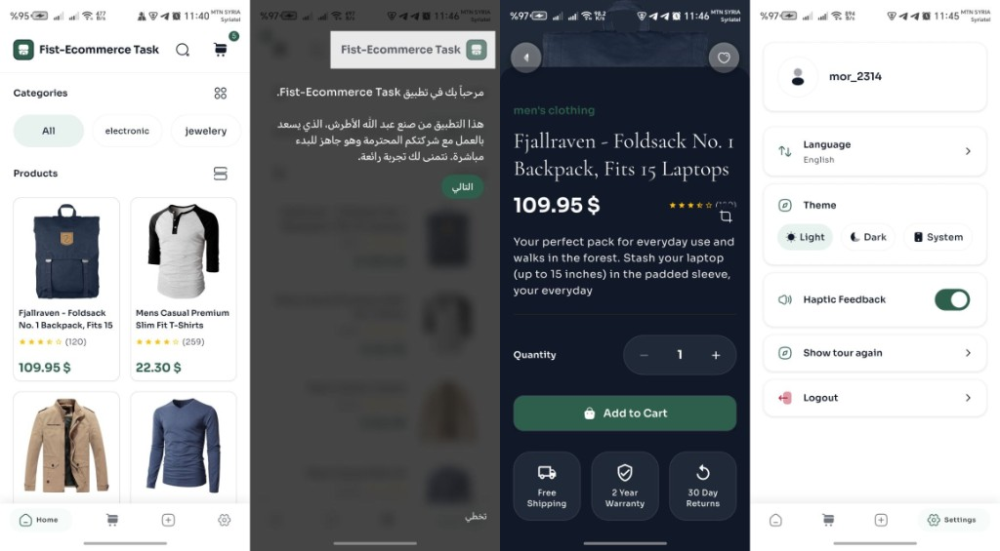
</p>

*Home • Onboarding (Arabic) • Product Details (Dark) • Settings*

---

## 📌 Executive Summary

This Flutter E-Commerce application was built as a **technical assessment** to demonstrate production-grade mobile engineering. The app integrates with [FakeStoreAPI](https://fakestoreapi.com/) to deliver a full shopping experience: product browsing, category filtering, product details, cart management with SQLite persistence, and the ability to add new products via API.

**The challenge scope** included: Home (products + categories), Product Details, Add to Cart, Cart with quantity updates, and Add New Product. **The solution exceeds these requirements** by implementing:

- **Feature-first DDD architecture** with strict layer separation (domain/data/presentation)
- **BLoC state management** with a unified `BlocStatus` pattern (initial, loading, success, fail)
- **SQLite-backed cart** as the source of truth (FakeStoreAPI cart is simulated; local persistence ensures reliability)
- **Bilingual localization** (Arabic/English) with RTL support
- **Light & Dark themes** with dynamic switching and persistence
- **Onboarding coach tour** for first-launch guidance with confetti celebration
- **Smart client-side search** across title, category, and description
- **Haptic feedback** with user-controlled toggle
- **Custom app branding** and polished UX (skeleton loaders, error states, empty states)
- **Environment-based configuration** via `.env` — API URL and timeouts externalized; secrets never hardcoded

The engineering mindset behind this project prioritizes **maintainability**, **testability**, and **scalability**—every architectural decision is intentional and documented.

---

## 🏗 Architecture Overview

### Architecture Pattern

The app follows **Feature-first Domain-Driven Design (DDD)** with **Clean Architecture** principles:

- **Domain Layer**: Pure Dart, no Flutter imports. Defines entities, abstract repositories, and use cases.
- **Data Layer**: Implements repositories, uses Freezed models, NetworkClient (Dio), and SQLite.
- **Presentation Layer**: BLoC for state, stateless widgets, no business logic in UI.

Each feature is self-contained under `features/<feature_name>/` with `domain/`, `data/`, and `presentation/` subfolders.

### State Management

**BLoC (flutter_bloc)** was chosen for:

- **One-way data flow**: UI → Event → BLoC → State → UI
- **Predictable, testable logic** outside the widget tree
- **Separation of concerns**: UI is purely reactive; no `setState` for domain logic
- **Scalability**: Easy to add new events and states without refactoring

A shared **`BlocStatus`** pattern (`initial`, `loading`, `loadingMore`, `success`, `fail`) ensures consistent handling of loading, success, and error states across all features.

### API Layer Design

- **NetworkClient**: Centralized Dio-based client with `Either<NetworkFailure, Response>` for type-safe error handling
- **ApiConfig**: Centralized base URL and path constants
- **Data sources**: Remote (API) and Local (SQLite) data sources per feature
- **Repositories**: Implement domain contracts; map models to entities; handle `Either` from data sources

### Error Handling Strategy

- **NetworkClient** returns `Either<NetworkFailure, Response>`; maps `DioException` to user-friendly messages
- **UiHelperStatus** widget: Converts raw errors to friendly messages (timeout, no internet, 404, etc.) with retry support
- **BlocStatus.when()**: Pattern-matching builder for consistent UI (loading skeleton, success content, error + retry)

### Dependency Management

- **get_it** for dependency injection
- Feature-level `di.dart` files; aggregated in `core/di/app_dependencies.dart`
- Lazy singletons for services; factory for BLoCs (disposed on unmount)

### Scalability Considerations

- Feature-first structure allows parallel development and isolated testing
- Abstract repositories enable swapping implementations (e.g., mock API for tests)
- Use cases encapsulate business logic; easy to add new flows

---

### Architecture Diagrams

#### Data Flow (High-Level)

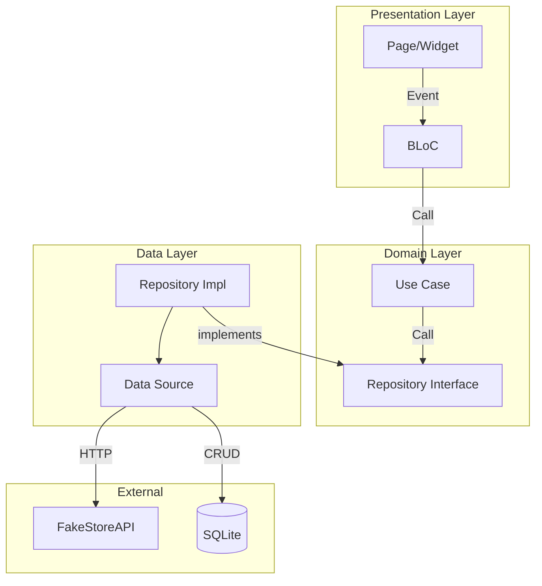

#### Layered Architecture

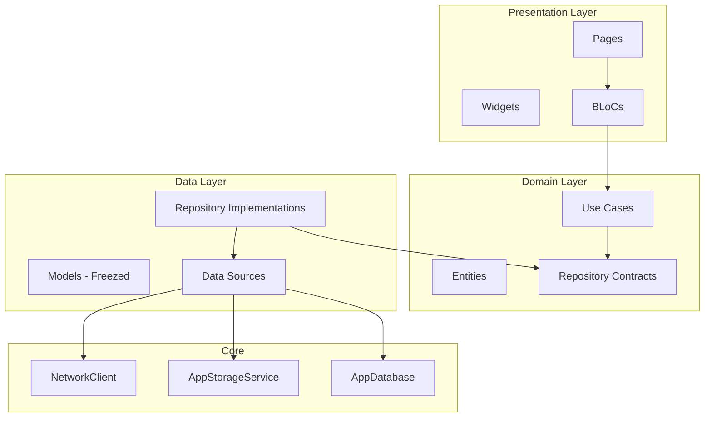

---

## 📱 Core Features (Task Requirements)

### Home Screen (Products + Categories)

| Aspect | Implementation |
|--------|----------------|
| **Technical** | `HomeBloc` fetches products and categories via use cases. Products from `GET /products` or `GET /products/category/{name}`. Categories from `GET /products/categories`. `HomeContent` renders category chips and product grid/list. |
| **Edge Cases** | Empty category list → fallback "All" chip. API failure → `UiHelperStatus` with retry. Pull-to-refresh supported. |
| **Performance** | `SliverChildBuilderDelegate` for lazy grid/list. `RepaintBoundary` on category section. `buildWhen` on `BlocBuilder` to minimize rebuilds. Staggered entrance animations with `scrollOptimized` to avoid delays on fast scroll. |

### Product Details

| Aspect | Implementation |
|--------|----------------|
| **Technical** | `ProductDetailsPage` receives `ProductDetailsPayload` via `go_router` extra. Hero animation for image. Quantity selector and Add to Cart dispatch `CartBloc.add(AddToCart)`. |
| **Edge Cases** | Mock payload support for coach tour. Null `productId` disables Add to Cart. |
| **Performance** | Hero animation for smooth transition. Scroll-based parallax on hero image. |

### Add to Cart

| Aspect | Implementation |
|--------|----------------|
| **Technical** | `CartBloc.add(AddToCart(productId, quantity))` → `ICartRepository.addOrUpdateItem` → SQLite `CartLocalDataSource.addOrUpdate` (upsert). `CartBloc` then triggers `LoadCart` to refresh UI. |
| **Edge Cases** | Upsert logic: same product ID updates quantity. Product resolution from `IProductRepository` for display (handles products not in current list). |
| **Performance** | Cart count in bottom nav uses `buildWhen: (prev, curr) => prev.itemCount != curr.itemCount`. |

### Cart Management with Quantity Updates

| Aspect | Implementation |
|--------|----------------|
| **Technical** | `CartLocalDataSource` (SQLite) is source of truth. `UpdateQuantity` and `RemoveItem` events. `CartBloc` resolves product details via `IProductRepository` for each item. |
| **Edge Cases** | Empty cart → `CartEmptyWidget`. Product not found in API → display with null product (graceful degradation). Line total computed per item. |
| **Performance** | `CartListContent` uses list builder. `CartBloc` batches product resolution. |

### Add New Product (API Integration)

| Aspect | Implementation |
|--------|----------------|
| **Technical** | `AddProductBloc` uses `AddProductUseCase` → `ProductRemoteDataSource.addProduct` → `POST /products`. Form fields: title, price, description, category (chips from API), image URL. Validation via `ProductNameValidator`, `PriceValidator`, `DescriptionValidator`, `UrlValidator`. |
| **Edge Cases** | Categories load failure → fallback to hardcoded list. Success → navigate to product details with created product. |
| **Performance** | Categories loaded once on tab mount. Form validation on submit only. |

---

## ✨ Advanced Enhancements (Beyond Requirements)

### Bilingual Localization (Arabic / English with RTL)

- **Why**: Broader reach; RTL is essential for Arabic UX.
- **Implementation**: `easy_localization` with `assets/translation/en.json` and `ar.json`. `LocaleService` toggles and persists via `AppStorageService`. `MaterialApp` uses `context.locale` and `context.localizationDelegates`.
- **Engineering**: Locale persisted so preference survives app restart. `AppText` widget uses `.tr()` for translations. RTL layout handled automatically by Flutter when locale is `ar`. |

### Light & Dark Theme System (Dynamic Switching)

- **Why**: User preference; reduces eye strain; modern expectation.
- **Implementation**: `ThemeModeNotifier` (Listenable) holds `ThemeMode` (light/dark/system). `AppStorageService.setThemeMode` persists. `MaterialApp` uses `theme`, `darkTheme`, and `themeMode: themeNotifier.value`. `ThemeTransition` wrapper for smooth transitions.
- **Engineering**: System brightness changes trigger rebuild when `ThemeMode.system`. Custom `AppColorExtension` for semantic colors (profit, loss, etc.). |

### Haptic Feedback Toggle

- **Why**: Accessibility; some users prefer reduced motion/haptics.
- **Implementation**: `AppHaptic` static class with `setEnabled(bool)`. `SettingsBloc` toggles via `SettingsHapticToggled`; persists to `AppStorageService`. Light tap on toggle before disabling so user feels it one last time.
- **Engineering**: Centralized haptic service; no-op implementation available for testing. |

### Smart Search (Client-Side Filtering)

- **Why**: Instant feedback; no extra API calls; works offline for cached data.
- **Implementation**: `HomeContent._filterProductsByQuery` filters by `title`, `category`, and `description` (case-insensitive). `SearchQueryChanged` event updates state; UI rebuilds with filtered list. `EmptySearchResultWidget` when no matches.
- **Engineering**: Client-side keeps latency low; avoids rate limits. Search highlight in product names via `TextWithHighlight`. |

### Onboarding Walkthrough System

- **Why**: First-time users need guidance; reduces support burden.
- **Implementation**: `CoachTourOrchestrator` uses `tutorial_coach_mark`. Targets: App bar, search, categories, products, cart, add product, settings. `CoachTourStorage` (SharedPreferences) tracks completion. On finish → confetti overlay. "Show tour again" in Settings.
- **Engineering**: GlobalKeys for targets; tab switching during tour; mock product details for tour-specific navigation. |

### Custom App Branding

- **Why**: Professional identity; distinguishes from generic apps.
- **Implementation**: Custom launcher icon (`assets/logo/logo.png`), `flutter_launcher_icons` config. Custom fonts (Sora, Baloo, Cormorant Garamond). `AppColors` (primary green `#2D5F4C`, navy `#111827`). `ThemeData` with `ColorScheme`, `TextTheme`, `CardTheme`, `InputDecorationTheme`.
- **Engineering**: Design tokens in `AppColorExtension`; consistent spacing via `flutter_screenutil`. |

### Improved Cart Logic (State Persistence, Edge Cases)

- **Why**: FakeStoreAPI cart is simulated; local persistence ensures reliability.
- **Implementation**: SQLite via `sqflite`; `CartSchema` defines table. `CartLocalDataSourceImpl` handles add/update/remove. `ConflictAlgorithm.replace` for upsert. Product resolution: batch from `getProducts`, then per-item `getProductById` for missing IDs.
- **Engineering**: Cart survives app restart. Handles products removed from API (null product in display). |

---

## 🔌 API Integration

### Base URL

Configurable via `API_BASE_URL` in `.env` / `.env.example`. Default:

```
https://fakestoreapi.com
```

### Endpoints Used

| Method | Path | Purpose |
|--------|------|---------|
| GET | `/products` | All products |
| GET | `/products/categories` | Category names |
| GET | `/products/category/{name}` | Products by category |
| GET | `/products/{id}` | Single product |
| POST | `/products` | Create product (title, price, description, category, image) |

### Network Layer Structure

- **NetworkClient**: Singleton Dio instance with `BaseOptions` (timeouts from `API_TIMEOUT_SECONDS`, base URL from `API_BASE_URL`). Auth interceptor adds `Authorization: Bearer <token>` when available. `PrettyDioLogger` in debug mode.
- **Methods**: `get`, `post`, `put`, `patch`, `delete` — all return `Future<Either<NetworkFailure, Response>>`.

### Request/Response Modeling

- **ProductModel**: Freezed + `fromJson` for `/products` response
- **CreateProductResponseModel**: Freezed for POST response (id, title, price, etc.)
- **Categories**: Raw `List` of strings from API

### Error Handling Strategy

- **DioException** mapped to `NetworkFailure` with message, statusCode, errorType
- Timeout/connection errors → user-friendly messages
- `badResponse`: Extract message from `message`, `error`, `msg`, `detail` keys
- 401/400 → pass through API message for auth/validation

### Retry / Fallback Logic

- No automatic retry in NetworkClient (kept simple for assessment)
- UI provides manual retry via `UiHelperStatus.onRetry` and `RefreshHome` / `LoadCart`

### Mock Limitations Handled

- FakeStoreAPI cart endpoints exist but are not used; SQLite is source of truth
- POST /products returns mock ID; app handles created product display
- Some image URLs may be invalid; `CachedNetworkImage` with `errorBuilder`

### Environment-Based Configuration

API base URL and timeouts are loaded from environment variables via `flutter_dotenv` — no hardcoded API endpoints. See [Security & Environment](#-security--environment) for details.

---

### API Flow Diagram

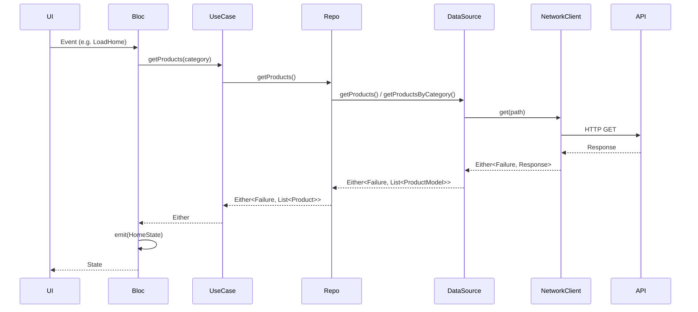

---

## 📂 Project Structure

```
.
├── .env.example          # API config template (committed)
├── .env                  # Local overrides (gitignored)
├── lib/
│   ├── core/
│   │   ├── animation/          # Entrance, stagger, spring curves
│   │   ├── auth/               # AuthGuard
│   │   ├── component/          # Reusable UI (buttons, chips, snackbar)
│   │   ├── config/             # ApiConfig (reads .env)
│   │   ├── database/           # AppDatabase, CartSchema, DI
│   │   ├── di/                 # app_dependencies.dart (get_it setup)
│   │   ├── domain/             # Failure
│   │   ├── haptic/             # AppHaptic, HapticService
│   │   ├── localization/       # LocaleKeys, AppText
│   │   ├── network/            # NetworkClient
│   │   ├── routing/            # AppRouter, AppRoutes (go_router)
│   │   ├── shared/             # AppScaffold, LocaleService, ExitDialog
│   │   ├── status/             # BlocStatus, UiHelperStatus
│   │   ├── storage/             # AppStorageService, StorageKeys
│   │   ├── theme/              # app_theme, ThemeModeNotifier, AppColorExtension
│   │   └── validation/         # Form validators
│   ├── features/
│   │   ├── add_product/
│   │   │   ├── data/           # di, models, repositories, datasources
│   │   │   ├── domain/         # usecases
│   │   │   └── presentation/   # bloc, pages, widgets
│   │   ├── auth/
│   │   ├── cart/
│   │   ├── coach_tour/
│   │   ├── home/
│   │   ├── product_details/
│   │   └── settings/
│   ├── gen/                    # flutter_gen (assets, fonts)
│   ├── mock_data/              # Mock payloads for coach tour, etc.
│   ├── skeleton_features/      # Skeleton loaders per feature
│   └── main.dart
```

**Reasoning**:

- **`.env.example` / `.env`**: API config externalized; `.env` gitignored to avoid committing secrets.
- **Feature-first**: Each feature owns its domain, data, and UI. Easy to locate and test.
- **Core**: Shared infrastructure (network, storage, theme, validation) used across features.
- **gen/**: Generated code (assets, fonts) — not edited manually.
- **skeleton_features**: Dedicated skeleton UIs for loading states, keeping presentation clean.

---

## 🧠 Engineering Decisions & Trade-offs

### Why BLoC Over Provider/Riverpod

- **Testability**: BLoC logic is pure; easy to unit test without widget tree.
- **Predictability**: One-way flow reduces bugs from scattered state updates.
- **Scalability**: New events/states don't require refactoring existing code.
- **Team familiarity**: BLoC is widely used in production Flutter apps.

### Rebuild Optimization

- **BlocBuilder.buildWhen**: Only rebuild when relevant state fields change (e.g. `itemCount`, `status`, `products`).
- **BlocProvider.value**: Reuse existing BLoC instance instead of creating new one (e.g. CartBloc in CartPage).
- **RepaintBoundary**: Isolate expensive sections (e.g. category chips) to limit repaints.
- **ValueKey/KeyedSubtree**: Stable keys reduce element churn on scroll and during coach tour.

### Patterns Avoided

- **setState for domain logic**: All async/state logic in BLoC; UI is dumb.
- **Direct API calls from UI**: All go through use cases and repositories.
- **Global state for cart**: CartBloc provided at app level; cart count shared via BlocBuilder.
- **External chart libraries**: Not needed for this scope; kept dependencies minimal.

### How the App Can Scale

- Add new features by creating `features/<name>/` with domain/data/presentation.
- Swap API implementation (e.g. real backend) by implementing same repository interfaces.
- Add caching (e.g. LRU) in data layer without changing domain.
- Add integration tests per feature; unit tests for use cases and repositories.

### Future Improvement Plan

- Unit tests for use cases, repositories, and BLoCs
- Integration tests for critical flows (add to cart, add product)
- CI/CD (GitHub Actions) for lint, test, build
- Optional retry/backoff in NetworkClient for transient failures
- Offline-first strategy with cache-and-sync when backend is ready

---

## 📊 Performance & Optimization

| Area | Optimization |
|------|--------------|
| **Widget rebuilds** | `buildWhen` on BlocBuilder; `listenWhen` on BlocListener; ListenableBuilder for theme |
| **List rendering** | `SliverChildBuilderDelegate` for lazy grid/list; `SliverGrid` with fixed cross axis |
| **API calls** | Categories fetched once on initial load; reused on refresh/category switch |
| **Memory** | Controllers disposed in dispose(); BLoC closed on unmount |
| **Startup** | `configureDependencies()` async; `AppRouter.initialize()` before runApp |
| **Animations** | `scrollOptimized` for staggered entrance; `AnimationConstants.shouldReduceMotion` for accessibility |

---

## 🔐 Reliability & UX Considerations

| Area | Implementation |
|------|----------------|
| **Loading states** | Skeleton loaders (`HomeSkeleton`, `CartSkeleton`, `AddProductSkeleton`) with `BlocStatus` |
| **Error states** | `UiHelperStatus` with friendly messages, retry button, and contextual images |
| **Empty states** | `CartEmptyWidget`, `EmptyHomeContentWidget`, `EmptySearchResultWidget` |
| **Offline** | No explicit offline mode; errors show "No internet" via `ErrorMessageHelper` |
| **User feedback** | `AppSnackbar` for success/error/info; haptic on tab change; confetti on tour completion |

---

## 🧩 Soft Skills Demonstrated

- **Ownership**: End-to-end delivery from architecture to UX polish; no placeholder screens.
- **Going beyond requirements**: Localization, themes, haptics, onboarding, search, and cart persistence.
- **Product thinking**: Empty states, error messages, retry flows, and accessibility (reduce motion).
- **Attention to detail**: Consistent BlocStatus handling, proper disposal, edge case handling.
- **Clean communication**: Feature structure, naming, and comments explain intent.
- **Documentation**: Inline comments and this README for onboarding and review.
- **Git discipline**: Logical commits (not shown here but recommended: feature branches, conventional commits).

---

## 🔐 Security & Environment

The app uses **environment variables** for API configuration, keeping sensitive or environment-specific values out of source code. This follows the [12-Factor App](https://12factor.net/config) principle and improves security when switching between development, staging, and production backends.

### How It Works

| File | Purpose | Committed? |
|------|---------|------------|
| `.env.example` | Template with safe defaults; bundled as asset | ✅ Yes |
| `.env` | Local overrides (API URL, timeouts, future secrets) | ❌ No (in `.gitignore`) |

- **`flutter_dotenv`** loads `.env.example` at startup (see `main.dart`).
- **`ApiConfig`** reads values via `dotenv.get()` with fallbacks.
- **`NetworkClient`** uses `ApiConfig.baseUrl` and `ApiConfig.connectTimeoutSeconds` — no hardcoded URLs.

### Environment Variables

| Variable | Description | Default | Example |
|----------|-------------|---------|---------|
| `API_BASE_URL` | Base URL for all API requests | `https://fakestoreapi.com` | `https://api.yourbackend.com` |
| `API_TIMEOUT_SECONDS` | Connection and receive timeout (seconds) | `15` | `30` |

### Setup for Local Overrides

1. Copy the template:
   ```bash
   cp .env.example .env
   ```
2. Edit `.env` with your values (e.g. staging/production API URL).
3. Add `.env` to `pubspec.yaml` assets and update `main.dart` to load `.env` instead of `.env.example` when present.

### Security Best Practices

- **Never commit `.env`** — it is listed in `.gitignore`; `.env.local` and `.env.*.local` are also ignored.
- **Use `.env.example`** for non-sensitive defaults so the app runs out of the box.
- **Future secrets** (e.g. API keys, Stripe publishable key) can be added to `.env` and read via `ApiConfig` — they will never be committed.
- **CI/CD**: Inject env vars at build time (e.g. GitHub Secrets) and generate `.env` in the pipeline instead of committing it.

---

## 🎨 Design (Figma)

This app was designed in **Figma** before implementation, ensuring a structured approach from design to code. The design system includes reusable components, consistent branding, and polished user flows.

| Design Asset | Description |
|--------------|-------------|
| **Figma Design Board** | Full design system: components, screens, and user flows |
| **Figma File** | [Add your Figma link here](https://www.figma.com/design/YOUR_FILE_KEY) |


*Design: Created by Abdullah Alatrash for Fist System Company Flutter Task*

---

## 📸 Screenshots

### App Screens Overview

The following composite shows the five core screens of the application:

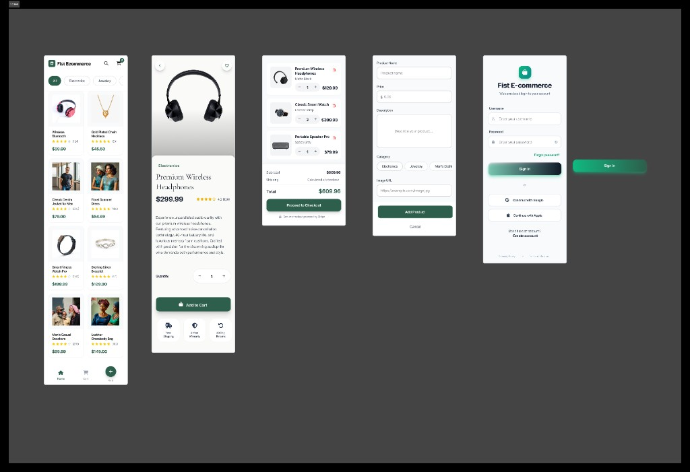

| Screen | Description |
|--------|-------------|
| **1. Home** | Product grid with category filters (All, Electronics, Jewellery), search, and cart |
| **2. Product Details** | Full product view with image, description, quantity selector, and Add to Cart |
| **3. Cart** | Cart items with quantity controls, subtotal, shipping, and Proceed to Checkout |
| **4. Add Product** | Form for Product Name, Price, Description, Category chips, and Image URL |
| **5. Login / Onboarding** | Sign-in screen with username/password and social auth options |

### Core Screens

| Screen | Preview |
|--------|---------|
| Home | 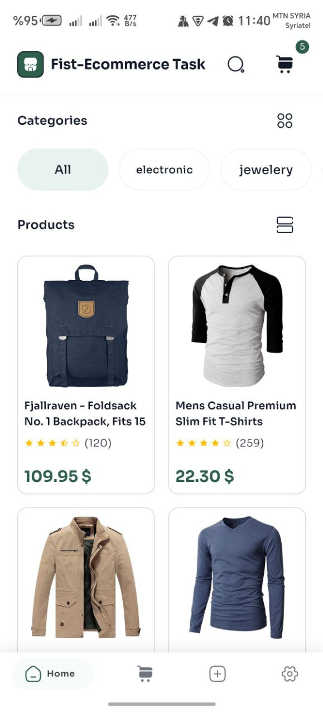 |
| Product Details | 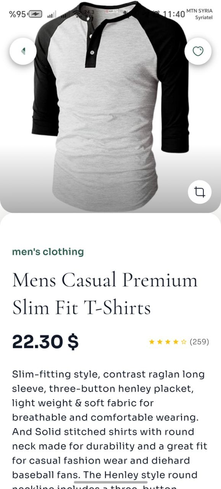 |
| Cart | 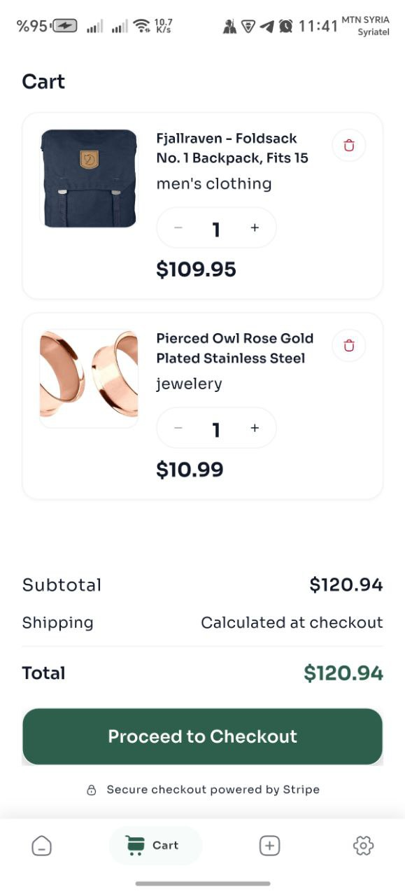 |
| Add Product | 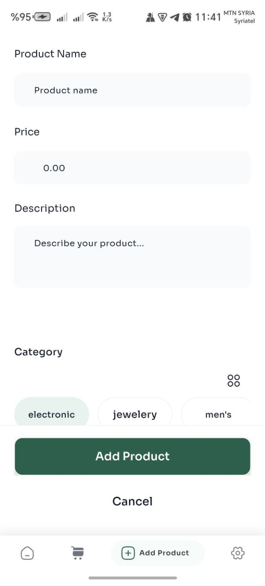 |
| Onboarding | 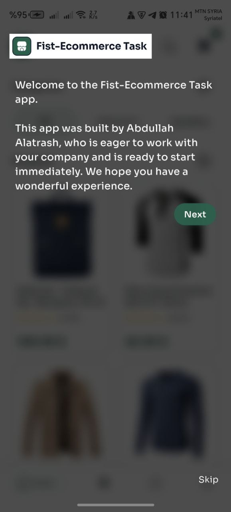 |

### Advanced Features (Theme, Search, Localization)

| Screen | Preview |
|--------|---------|
| Search | 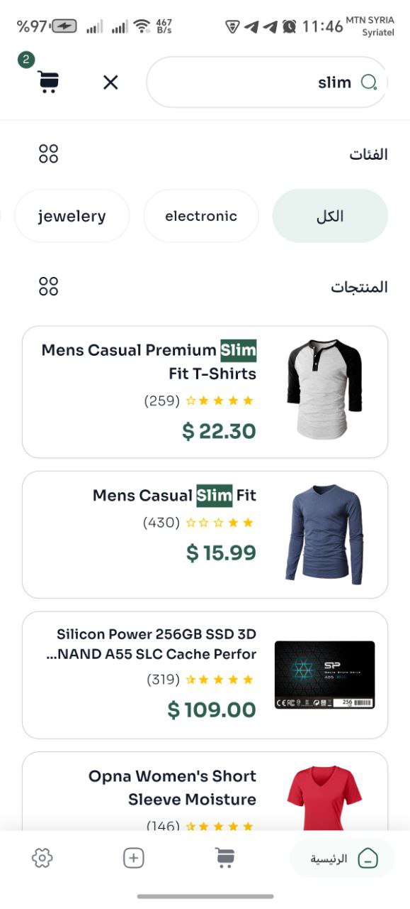 |
| Settings (Light) | 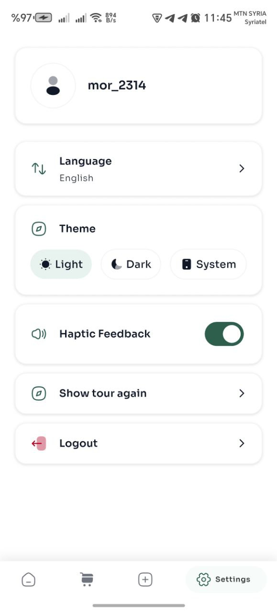 |
| Settings (Dark) | 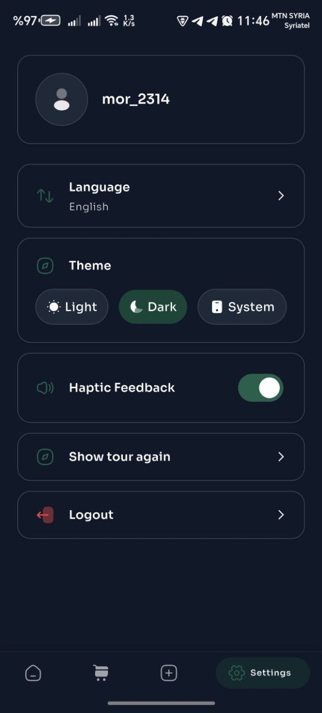 |
| Product Details (Dark) | 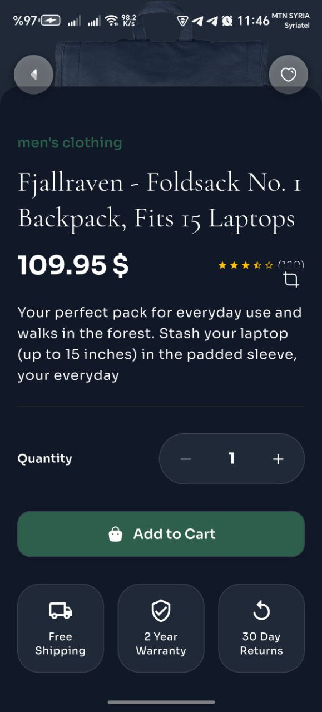 |
| Home (Arabic / RTL) | 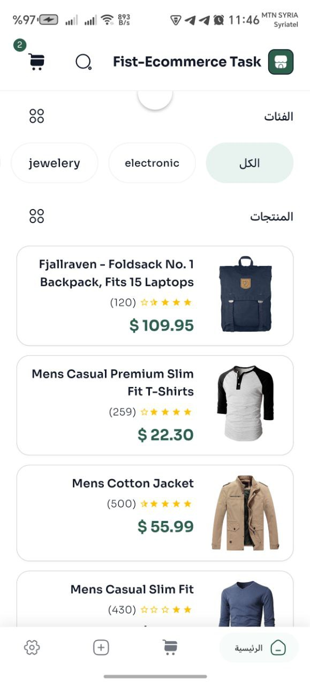 |
| Onboarding (Arabic) | 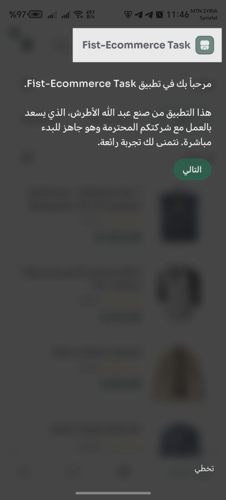 |
| Login (Arabic) | 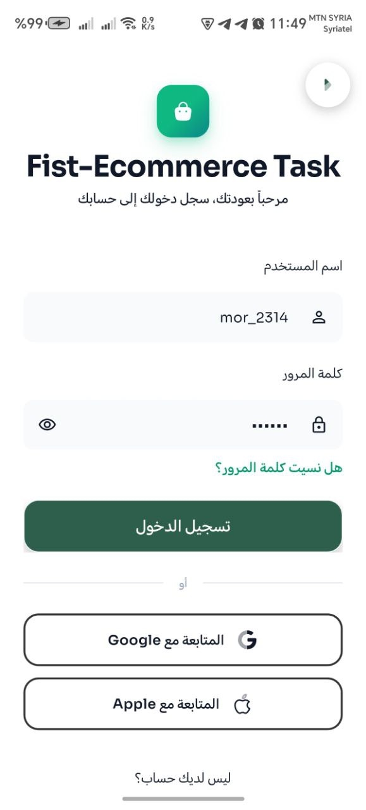 |

---

## 🛠 How to Run

### Prerequisites

- **Flutter**: 3.11.0 or higher (SDK `^3.11.0`)
- **Dart**: 3.11.0 or higher

### Setup

```bash
# Clone the repository
git clone <repository-url>
cd fsit_flutter_task_ecommerce

# Install dependencies
flutter pub get

# Generate code (Freezed, json_serializable, flutter_gen)
dart run build_runner build --delete-conflicting-outputs

# Run the app
flutter run
```

### Environment

- **Default**: `.env.example` is bundled; the app runs out of the box with FakeStoreAPI.
- **Custom config**: See [Security & Environment](#-security--environment) for `.env` setup and variable reference.
- Internet connection needed for product/category API calls.
- iOS/Android simulators or physical devices supported.

---

## 🧪 Future Roadmap

### Suggested Future Design

<p align="center">
  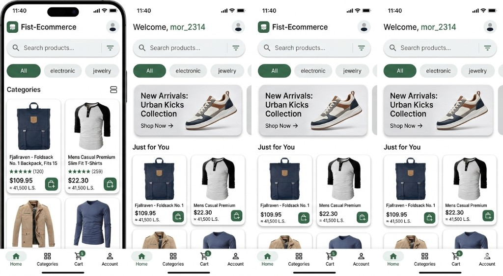
</p>

*Potential enhancements: Welcome banner, New Arrivals section, "Just for You" personalization, enhanced Categories view, and Account tab.*

### Planned Improvements

| Item | Description |
|------|-------------|
| **Unit Testing** | Use case, repository, and BLoC tests with mocks |
| **Integration Testing** | Critical flows: add to cart, add product, navigation |
| **CI/CD Pipeline** | GitHub Actions: `flutter analyze`, `flutter test`, `flutter build` |
| **Caching Layer** | LRU cache for products/categories; offline-first when backend supports it |
| **Backend Abstraction** | ✅ Done: Environment-based API URL via `flutter_dotenv` (`.env.example`) |
| **Payment Gateway** | Placeholder for Stripe/other when moving to production |

---

## 👤 About the Engineer

This project was built by a **Senior Flutter Engineer** with strong experience in **API integration**, **architecture design**, and **production-ready mobile apps**. The codebase reflects:

- **Flutter expertise**: BLoC, go_router, Freezed, dependency injection, and responsive layout
- **API integration**: Type-safe networking with Either, error mapping, and repository abstraction
- **Architecture thinking**: Feature-first DDD, clear layer boundaries, and testable domain logic
- **Performance awareness**: Lazy lists, rebuild optimization, and skeleton loaders
- **Clean code principles**: SOLID, DRY, and consistent patterns across features
- **Product mindset**: Localization, themes, onboarding, and polished UX

The goal is to ship apps that are **maintainable**, **scalable**, and **delightful** for users.

---

*Built with Flutter • FakeStoreAPI • BLoC • SQLite • Easy Localization • go_router*