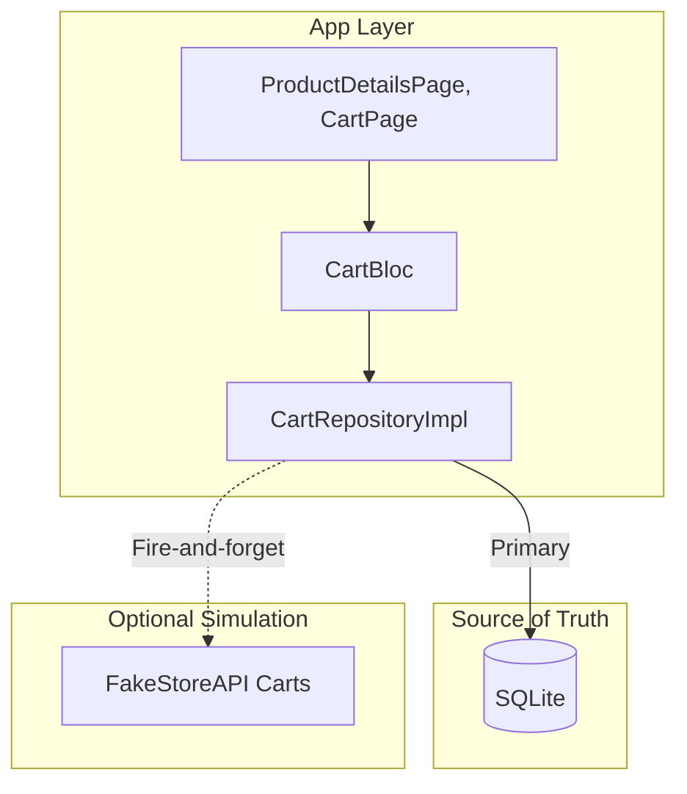
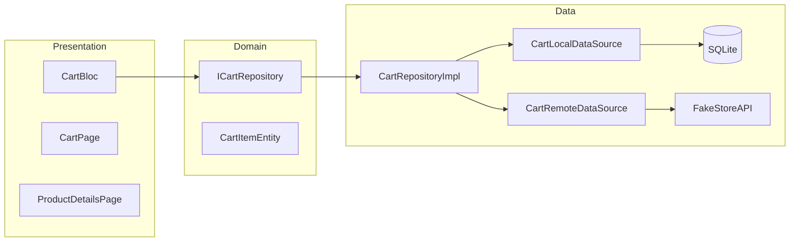
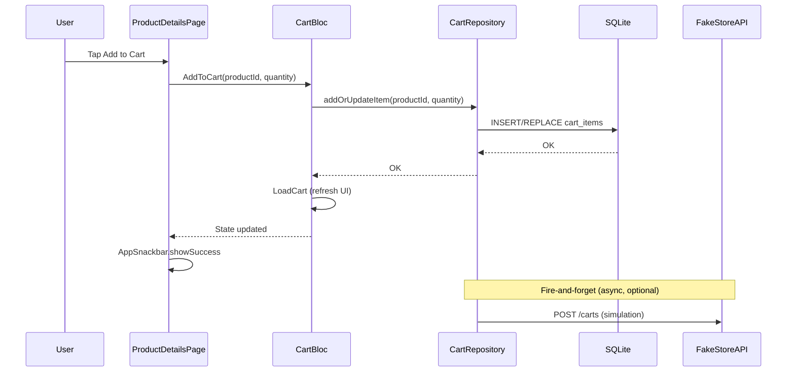
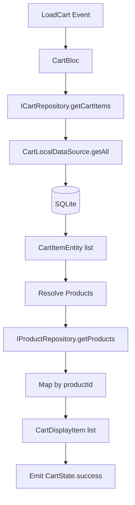
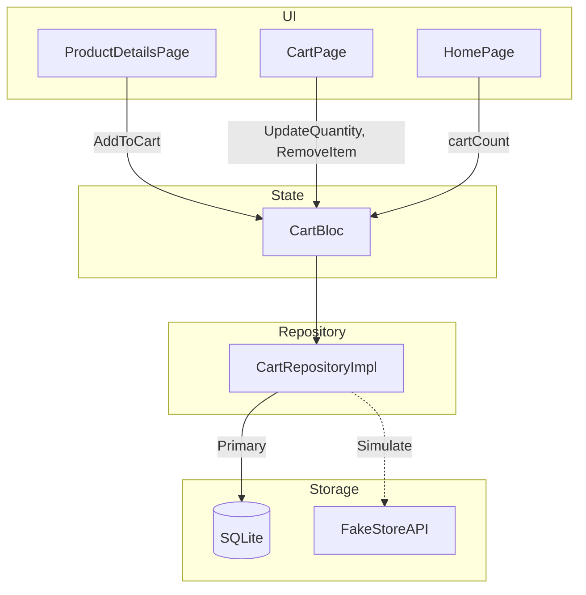

# Cart Feature — Implementation Documentation

This document describes the **cart feature** implementation: the FakeStoreAPI cart limitations, our approach, and the DDD-compliant solution using SQLite as the source of truth.

---

## 1. What FakeStoreAPI Provides

### 1.1 Cart Endpoints

FakeStoreAPI exposes standard REST cart operations:

| Method | Endpoint        | Description                    |
|--------|-----------------|--------------------------------|
| GET    | `/carts`        | Get all carts                  |
| GET    | `/carts/{id}`   | Get a single cart by ID        |
| POST   | `/carts`        | Create a new cart              |
| PUT    | `/carts/{id}`   | Update an existing cart        |
| DELETE | `/carts/{id}`   | Delete a cart                  |

### 1.2 Request/Response Format

**Create cart (POST) — JSON body:**

```json
{
  "userId": 1,
  "products": [
    { "productId": 1, "quantity": 2 },
    { "productId": 2, "quantity": 1 }
  ]
}
```

**Response (201):**

```json
{
  "id": 11,
  "userId": 1,
  "products": [
    { "productId": 1, "quantity": 2 },
    { "productId": 2, "quantity": 1 }
  ]
}
```

**Important:** `products` uses `productId` and `quantity` — not full Product objects. The API requires `Content-Type: application/json`; form-data does **not** work.

---

## 2. FakeStoreAPI Limitation: No Persistence

### 2.1 Root Cause

FakeStoreAPI is a **fake/mock API** for testing and prototyping. It simulates CRUD behavior but **does not persist** data from POST, PUT, or DELETE requests. All writes are ephemeral.

### 2.2 Observed Behavior

| Action                 | Result                                           |
|------------------------|--------------------------------------------------|
| `POST /carts`          | Returns 201 with a cart object and generated `id` |
| `GET /carts`           | Returns only the **7 pre-seeded carts** (ids 1–7) |
| `GET /carts/{newId}`   | Returns **`null`** — the cart was never stored   |
| `GET /carts/1`         | Returns cart data — pre-seeded carts exist       |
| `PUT /carts/{id}`      | Simulated; no persistence                        |
| `DELETE /carts/{id}`   | Simulated; no persistence                        |

### 2.3 Implications

- You **cannot** rely on FakeStoreAPI for cart storage.
- A real cart feature requires a **client-side persistence** strategy.
- The API can still be used for **simulation** (fire-and-forget) to validate request/response shapes.

---

## 3. Our Solution: SQLite + FakeStoreAPI Simulation

### 3.1 High-Level Approach



**Strategy:**

1. **SQLite** — Source of truth for all cart data (add, update, remove).
2. **FakeStoreAPI** — Called optionally for simulation (non-blocking, fire-and-forget). Do not rely on responses for persistence.
3. **Product resolution** — Cart items store `productId` and `quantity`; display data comes from `IProductRepository` (GET `/products` or `/products/{id}`).

---

## 4. Architecture Overview

### 4.1 DDD Layer Structure



### 4.2 Data Flow — Add to Cart



### 4.3 Data Flow — Cart Page Load



---

## 5. File Structure

### 5.1 Core Database (SQLite)

```
lib/core/database/
├── app_database.dart    # Opens DB, migrations
├── cart_schema.dart     # Table DDL, column names
└── di.dart              # DB-related DI (reserved)
```

**Schema:**

```sql
CREATE TABLE cart_items (
  id INTEGER PRIMARY KEY AUTOINCREMENT,
  product_id INTEGER NOT NULL UNIQUE,
  quantity INTEGER NOT NULL DEFAULT 1,
  created_at INTEGER NOT NULL
);
```

`UNIQUE(product_id)` ensures one row per product; `ConflictAlgorithm.replace` provides upsert semantics.

### 5.2 Cart Feature (DDD)

```
lib/features/cart/
├── domain/
│   ├── entities/
│   │   ├── cart_item_entity.dart   # productId, quantity
│   │   └── cart_entity.dart        # items, itemCount
│   └── repositories/
│       └── cart_repository.dart    # ICartRepository
├── data/
│   ├── models/
│   │   └── cart_item_model.dart    # DB row mapping
│   ├── datasources/
│   │   ├── cart_local_data_source.dart   # SQLite CRUD
│   │   └── cart_remote_data_source.dart # FakeStoreAPI client
│   ├── repositories/
│   │   └── cart_repository_impl.dart    # SQLite + optional sync
│   └── di.dart
├── presentation/
│   ├── bloc/
│   │   ├── cart_bloc.dart
│   │   ├── cart_event.dart
│   │   └── cart_state.dart
│   ├── pages/
│   │   └── cart_page.dart
│   ├── widgets/
│   │   └── [cart_item, cart_total_section, ...]
│   └── utils/
│       └── cart_utils.dart        # formatCartPrice, etc.
```

---

## 6. Key Design Decisions

### 6.1 SQLite as Source of Truth

| Decision              | Rationale                                                                 |
|-----------------------|---------------------------------------------------------------------------|
| SQLite over SharedPrefs | Structured schema, queries, and better for cart items.                   |
| Separate `core/database/` | Reusable DB setup; cart feature stays focused.                            |
| `ConflictAlgorithm.replace` | Add same product → update quantity (upsert).                             |

### 6.2 FakeStoreAPI Integration

| Decision          | Rationale                                                                 |
|-------------------|---------------------------------------------------------------------------|
| Fire-and-forget   | Do not block UI; API does not persist.                                    |
| After local write | Call remote only after successful SQLite write.                           |
| No response logic | Do not rely on API response for success/failure.                          |
| POST only         | We POST the current cart snapshot for simulation; no GET by new ID.       |

### 6.3 Product Resolution

Cart items store only `productId` and `quantity`. Display needs title, image, price. Strategy:

1. Call `IProductRepository.getProducts()` once.
2. Build a `Map<productId, Product>` for cart product IDs.
3. For missing IDs, call `getProductById(id)` as fallback.
4. Build `CartDisplayItem(productId, quantity, product?)` for the UI.

### 6.4 CartBloc Scope

- **Singleton** at app root — shared across ProductDetailsPage, CartPage, HomePage (cart count).
- Provided via `BlocProvider<CartBloc>` in `MaterialApp.router` builder.
- Dispatches `LoadCart` on creation to hydrate state.

### 6.5 Add-to-Cart from Product Details

- `ProductDetailsPayload` includes `productId` (nullable; null for mock payload).
- Router passes `onAddToCart` callback when `productId != null`.
- Callback: `context.read<CartBloc>().add(AddToCart(...))` + `AppSnackbar.showSuccess`.
- CartBloc handles the rest (persist, LoadCart, update UI).

---

## 7. API Usage Summary

### 7.1 FakeStoreAPI Cart Endpoints (Implemented)

| Endpoint         | Method | Usage                                |
|------------------|--------|--------------------------------------|
| `/carts`         | GET    | GetAllCarts (not used in app flow)   |
| `/carts/{id}`    | GET    | GetCart (not used; returns null)     |
| `/carts`         | POST   | CreateCart — fire-and-forget sync    |
| `/carts/{id}`    | PUT    | UpdateCart (optional simulation)     |
| `/carts/{id}`    | DELETE | DeleteCart (optional simulation)     |

### 7.2 Product Endpoints (for Cart Display)

| Endpoint           | Method | Usage                                  |
|--------------------|--------|----------------------------------------|
| `/products`        | GET    | Bulk resolution for cart items         |
| `/products/{id}`   | GET    | Fallback for missing product in cart   |

---

## 8. User Feedback (Snackbars)

| Action       | Snackbar Type | Locale Key          |
|--------------|---------------|---------------------|
| Add to cart  | Success       | `cart_added`        |
| Quantity chg | Info          | `cart_updated`      |
| Remove item  | Info          | `cart_itemRemoved`  |
| Error        | Error         | (raw message)       |

---

## 9. Related Documentation

- [Postman README](../postman/README.md) — FakeStoreAPI cart behavior and correct JSON body.
- [Auth Feature DDD Design](./auth_feature_ddd_design.md) — Same DDD pattern reference.
- FakeStoreAPI docs: [https://fakestoreapi.com/docs](https://fakestoreapi.com/docs)

---

## 10. Summary Diagram



**In short:** The cart is stored in SQLite. FakeStoreAPI is used only for optional simulation. Product details come from the product API. The app provides a full, persistent cart experience despite FakeStoreAPI’s limitations.
